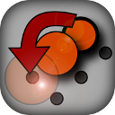

Peg-Solitaire
=============

- Start an online Peg Solitaire session:
  [Play in browser](http://omerkel.github.io/Peg-Solitaire/html5/src)
- Android APK available:
  [Releases](https://github.com/OMerkel/Peg-Solitaire/releases)
- Runs in various browsers on:
  - desktop systems like BSD, Linux, Windows, and macOS
  - mobile platforms like Android, Firefox OS, and iOS

Peg Solitaire supports several popular board shapes.

The mind-bending puzzle is well known with different board shapes and
different numbers of holes for peg placement. The common mechanic is that
a selected peg can jump one directly adjacent peg in a straight direction
onto a free position. The jumped peg is removed.

Supported board shapes include:

- triangular 15 peg positions (triangular 5)
- triangular 21 peg positions (triangular 6)
- English board
- French board

At the start, select one board position to be the single vacancy.

By jumping, the total number of pegs is reduced one by one until a single
peg remains. This class of challenges is called single vacancy to single
survivor. All starting positions of the 15-hole triangular board can end
with exactly one peg when played optimally.

If the single vacancy position matches the final survivor position, the
challenge is called a complement challenge. As an additional challenge,
find which vacancies do not allow a complement solution.

Consecutive jumps with the same peg may be possible depending on the board
state. Such chained jumps can be treated as a single move. The puzzle then
becomes finding solutions with the minimum number of moves.

Contributors / Authors
----------------------

- Oliver Merkel
- Portrait image:
  
- License badge:
  
- Image license:
  [Creative Commons Attribution-NonCommercial-NoDerivatives 4.0
  International License](http://creativecommons.org/licenses/by-nc-nd/4.0/)

_All logos, brands, and trademarks mentioned belong to their respective
owners._
