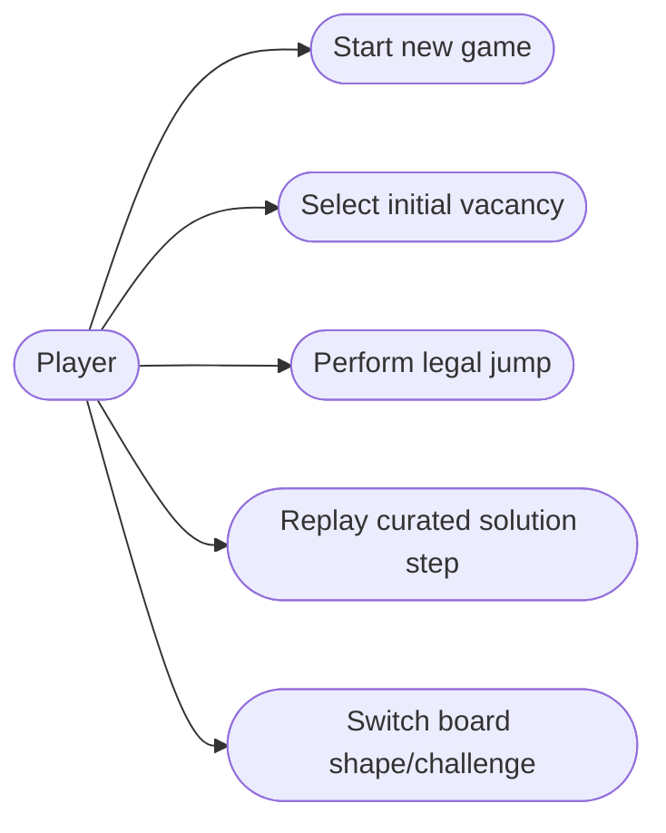
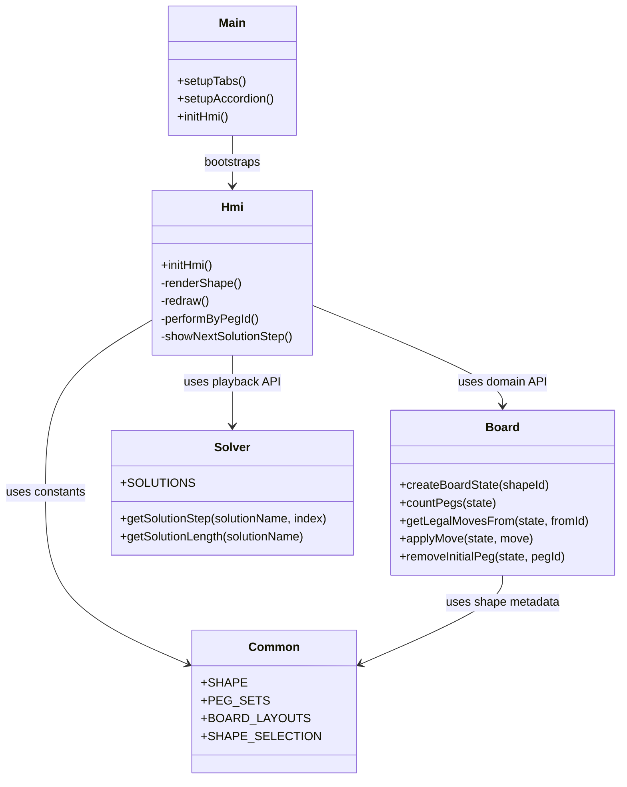
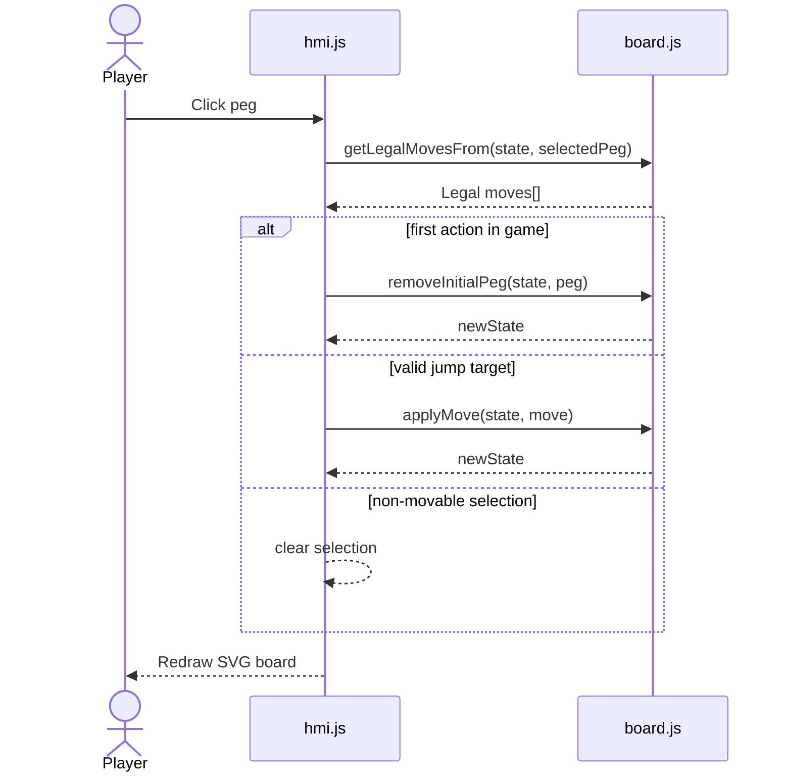
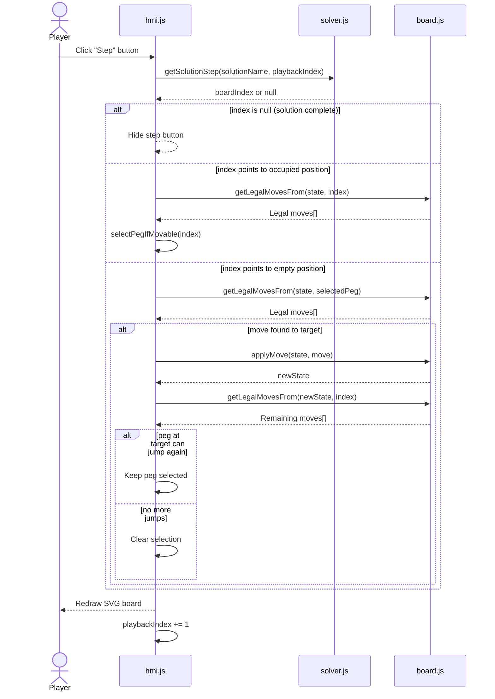
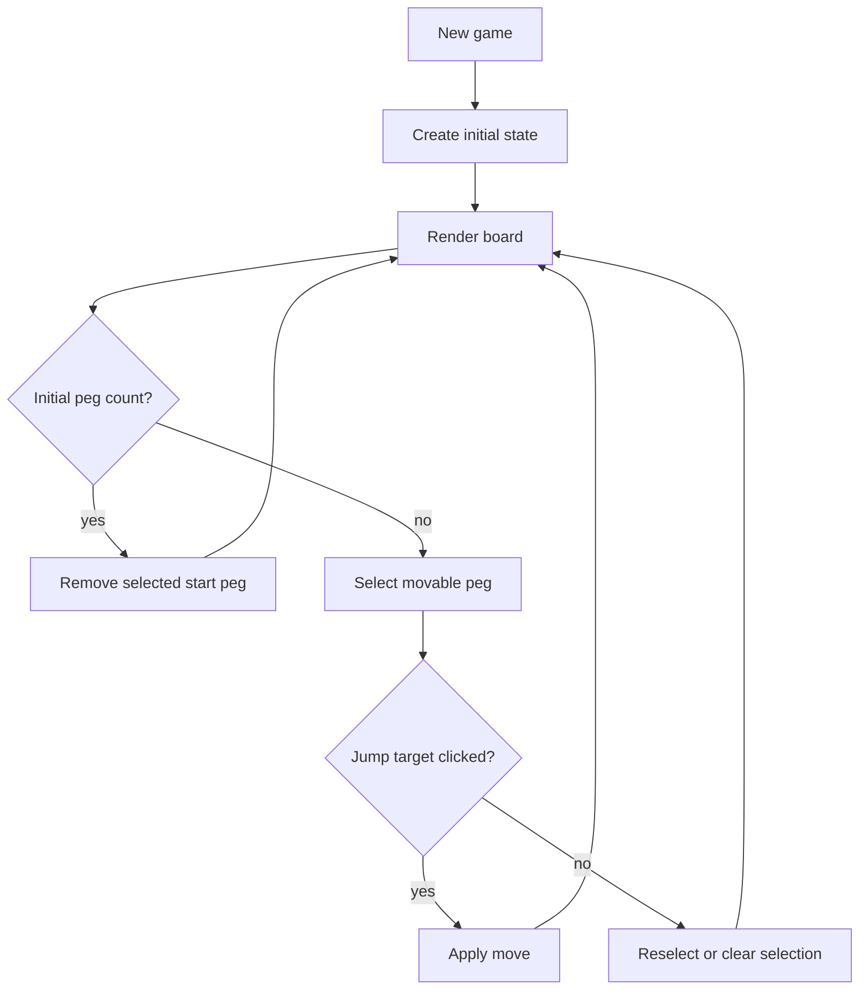
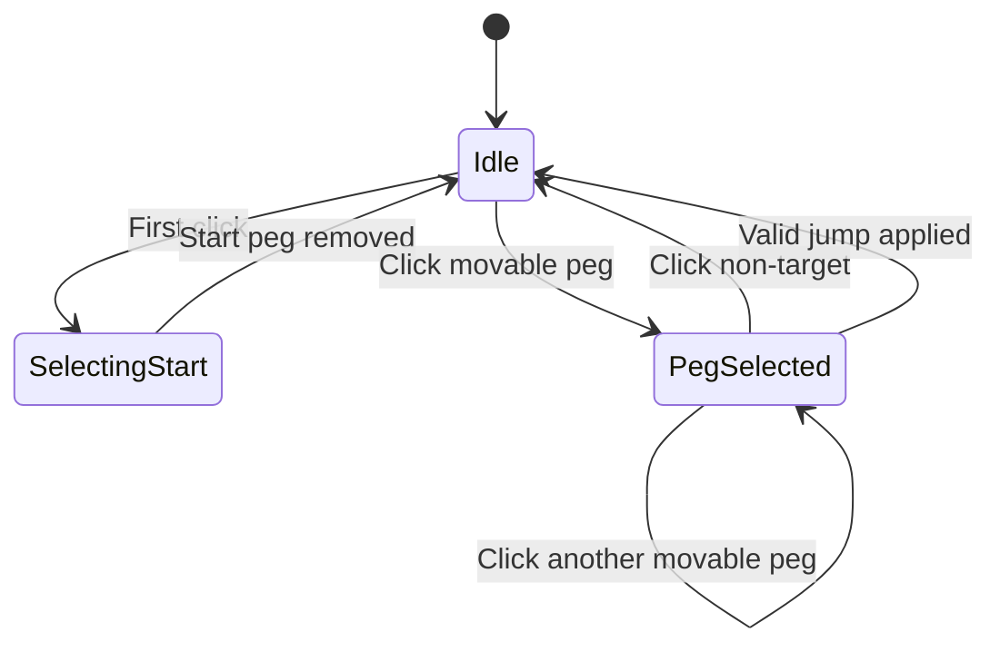
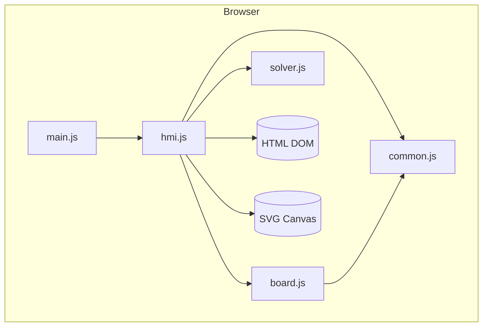
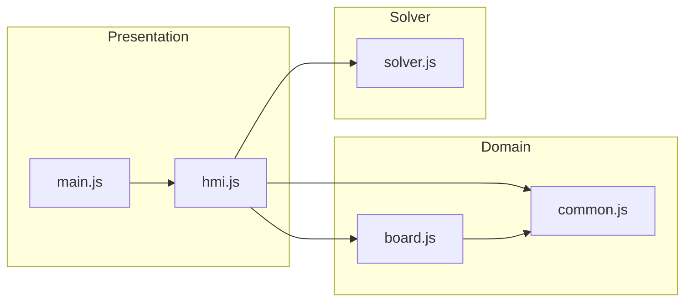
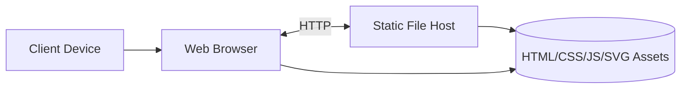
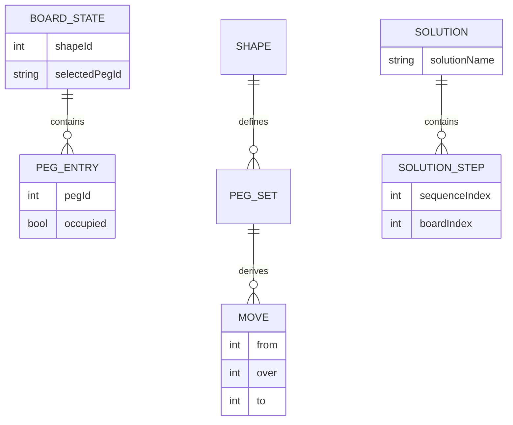

# Peg Solitaire Software Architecture

## Goals

- Remove runtime dependencies on third-party JavaScript/CSS libraries.
- Move to modular ES modules with clear boundaries.
- Isolate solver responsibilities into a dedicated module.
- Prefer immutable state transitions and pure domain logic.
- Keep the UI layer thin and focused on rendering and events.

## Architectural Style

The application follows a layered, module-oriented frontend architecture.

- Presentation layer: DOM/SVG rendering and interaction wiring.
- Application layer: orchestration of user intentions and game flow.
- Domain layer: board rules, legal move validation, state transitions.
- Solver layer: deterministic step sequences for curated solutions.

The architecture favors the following properties.

- Pure functions for domain transitions.
- Small modules with single responsibility.
- Dependency inversion from orchestration to abstractions (module APIs).
- Side effects isolated in UI/bootstrap modules.

## Module Overview

- html5/src/js/main.js: bootstraps tabs, accordion, and HMI.
- html5/src/js/hmi.js: UI/application orchestration over DOM and SVG.
  Handles solution playback with support for multi-jump sequences.
- html5/src/js/board.js: pure board model transitions and move generation.
- html5/src/js/solver.js: solution dataset and playback query helpers.
  Supports 10 curated solutions across 4 board types.
- html5/src/js/common.js: immutable constants and shared shape metadata.
- html5/src/css/index.css: responsive styling and UI component themes.
- html5/src/test/unit/: unit tests for all modules (27 tests, 97.77% coverage).
- html5/src/test/e2e/: end-to-end tests for user workflows (13 tests
  covering application and all 10 solutions).

## SOLID Mapping

- Single Responsibility Principle: each module has a clear, bounded purpose.
- Open/Closed Principle: new shapes/solutions are added by extending data.
- Liskov Substitution Principle: shape-specific rules satisfy shared contracts.
- Interface Segregation Principle: consumers call narrow function exports.
- Dependency Inversion Principle: main.js depends on init APIs, not internals.

## Functional Programming Practices

- Immutable state updates in board transitions (`applyMove`, `removeInitialPeg`).
- Pure selectors and derivations (`countPegs`, `getLegalMovesFrom`).
- Referential transparency in solver functions (`getSolutionStep`).
- Side effects restricted to event handlers and DOM mutations.

## Use Case Diagram

## Class Diagram

## Sequence Diagram - Manual Play

## Solution Playback

Solution steps are encoded as a sequence of board position indices. The
sequence alternates between occupied and empty positions, with a special rule
for **multi-jumps** (consecutive jumps by the same peg):

- **Occupied location** (has a peg): Select this peg for jumping
- **Empty location** (no peg): Jump to this target with the currently selected peg
- **Multi-jump rule**: After a jump, if the peg at the target location can
  jump again, it stays selected for the next step

### Solution Step Processing

This design naturally supports multi-jump sequences: the peg stays selected
at the target location if it can continue jumping, enabling seamless sweep
moves.

## Activity Diagram

## State Diagram

## Component Diagram

## Package Diagram

## Deployment Diagram

## Data Model Diagram

## Quality Attributes

- Maintainability: cohesive modules and explicit dependency graph.
- Testability: domain and solver logic are deterministic and side-effect free.
- Portability: standard browser APIs only.
- Performance: lightweight SVG rendering without framework overhead.

## Testing Strategy

The project employs a two-tier testing approach to ensure correctness
across domain logic and user workflows.

### Unit Tests (27 tests, 97.77% coverage)

Located in `html5/src/test/unit/`, these tests validate pure functions and
deterministic behaviors:

- **board.test.js** (7 tests): Board state transitions, move validation,
  legal move generation
- **common.test.js** (3 tests): Shape metadata, PEG_SETS consistency
- **solver.test.js** (4 tests): Solution data integrity, step access
  functions
- **hmi.test.js** (8 tests): UI orchestration, button visibility, selection
  logic
- **main.test.js** (5 tests): Module initialization and bootstrap

All domain logic (board.js, common.js, solver.js) achieves 100% coverage.

### End-to-End Tests (13 tests)

Located in `html5/src/test/e2e/`, these tests validate complete user
workflows using Playwright:

**Application Tests** (3 tests):

- Default board initialization and rendering
- Solution selection and playback interaction
- Tab and accordion navigation

**Solution Playback Tests** (10 tests):
Each solution type has a dedicated test that:

1. Selects the solution from the Options menu
2. Steps through the entire sequence
3. Verifies the step button hides when complete
4. Confirms the final board state (1 peg remaining)
5. Validates multi-jump sequences execute correctly

Covered solutions:

- English Solitaire - Castle & Heart
- Triangular5 - Corner, Mid Edge, Edge, Inner vacancies
- Triangular6 - Standard & Final Long Sweep
- French Solitaire - Version 1 & 2

### Test Architecture

- **Pure function tests**: board.js, common.js, solver.js use Vitest
- **Integration tests**: hmi.js interactions use Vitest with DOM mocking
- **System tests**: Complete workflows use Playwright against live server
- **CI/CD**: Run via `npm run test` (unit + e2e combined)

This multi-layer approach catches bugs at the logic level (unit tests) and
integration level (e2e tests), ensuring both correctness and user experience.

## Extensibility Guidelines

- Add new shape: extend SHAPE, PEG_SETS, BOARD_LAYOUTS, SHAPE_SELECTION.
- Add curated solution: add SOLUTIONS entry and link it to a radio id.
- Add auto-solver strategy: add a separate pure module and inject via
  hmi.js.

## Development Toolchain Baseline

### Runtime & Module System

- **Node.js**: LTS (18+) or current version
- **Module Format**: ES modules (type: "module" in package.json)
- **Package Manager**: npm 9.x or later

### Build & Serve Tools

- **http-server** 14.1.1: Static file server for development and e2e testing
- **biome** 2.5.7: Fast JavaScript/JSON linter and code quality tool

### Testing Framework

- **vitest** 3.2.4: Unit and integration test runner (Vite-native)
- **@vitest/coverage-v8** 3.2.7: Code coverage reporting
- **jsdom** 26.1.0: DOM environment for unit tests
- **@playwright/test** 1.55.0: End-to-end testing framework

### Documentation & Linting

- **markdownlint-cli** 0.49.1: Markdown style validation (enforces 80-char lines)

### Scripts

Run via `npm run <script>`:

- **test**: Run all tests (unit + e2e)
- **test:unit**: Run unit tests with coverage (97.77% target)
- **test:unit:watch**: Watch mode for development
- **test:e2e**: Run Playwright e2e tests
- **test:e2e:ui**: E2E tests with browser UI
- **lint**: Run all linters (markdown + biome)
- **lint:md**: Markdown linting
- **lint:biome**: JavaScript/JSON code quality

### Quality Gates

- **Test Coverage**: 97.77% (board.js, common.js, solver.js at 100%)
- **Code Quality**: Biome linting (enforces consistent style)
- **Documentation**: Markdown linting (80-character line limit)
- **E2E Coverage**: All 10 solutions validated end-to-end

### Configuration Files

- **package.json**: Dependencies and npm scripts
- **vitest.config.js**: Unit test configuration with JSDOM environment
- **playwright.config.js**: E2E test configuration (localhost:4173)
- **biome.json**: Linter rules and file exclusions
- **.markdownlintignore**: Markdown linting exclusions
